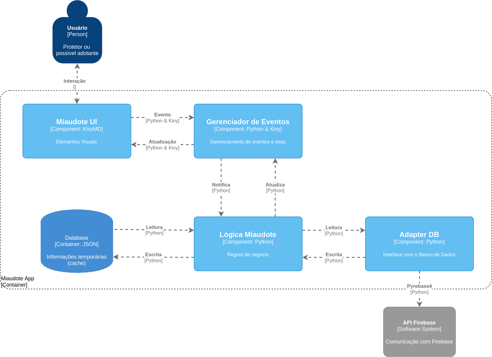

# Miaudote - Adoção de Pets

Projeto desenvolvido para disciplina MC426 (Engenharia de Software) realizada no segundo semestre de 2021 na UNICAMP. O mesmo objetiva-se a desenvolver uma plataforma que atue como ponte para a adoção de pets entre possíveis adotantes e protetores de animais.

## Team

- Cristiano Sampaio Pinheiro, RA 256352
- George Gigilas Junior, RA 216741
- Jhonatan Cléto, RA 256444
- Mylena Roberta dos Santos, RA 222687

## Arquitetura do Sistema

  *Modelo C4 - Diagrama de Componentes (Nível 3)*

Conforme demonstrado pela disposição dos componentes no diagrama, adotamos o estilo de **Camadas** (*Layering*) na elaboração da arquitetura.

> O estilo arquitetural de **Camadas** define uma disposição hierárquica dos módulos (camadas) que contêm as classes que dão forma ao sistema. Uma determinada camada *n* consome os serviços de uma camada *n-1* e fornece serviços a uma camada *n+1*.

Segue abaixo uma breve descrição sobre os principais componentes do sistema:

* Miaudote UI: responsável pela interação entre usuário e o aplicativo, contém os arquivos que definem os elementos visuais e suas disposições, isto é, as telas. Tem como base o KivyMD, uma biblioteca de Material Design para o *framework* Kivy.
* Gerenciador de Eventos: responsável por gerenciar os eventos disparados pelo componente Miaudote UI e também por atualizá-lo quando há necessidade. Tem como base o *framework* Kivy e o própria linguagem Python.
* Lógica Miaudote: responsável por toda a lógica interna do aplicativo, como classes com métodos que fazem leitura e escrita no banco de dados e na cache do aplicativo. Tem como base a linguagem de programação orientada a objetos Python.

Para o projeto do componente Adapter DB, desenvolvido para atuar como uma interface entre o aplicativo e o banco de dados, adotamos o padrão de projeto **Adapter**. Sendo que, nesta fase do projeto, o aplicativo somente faz uso do serviço de autenticação do Firebase através da biblioteca Pyrebase.

> O padrão de projeto estrutural **Adapter** permite que objetos com interfaces não compatíveis sejam capazes de colaborarem entre si. Especificamente em nosso contexto, este padrão de projeto foi aplicado com o intuito de possibilitar o uso de outros bancos de dados pelo aplicativo sem que haja a necessidade de inúmeras alterações de código.